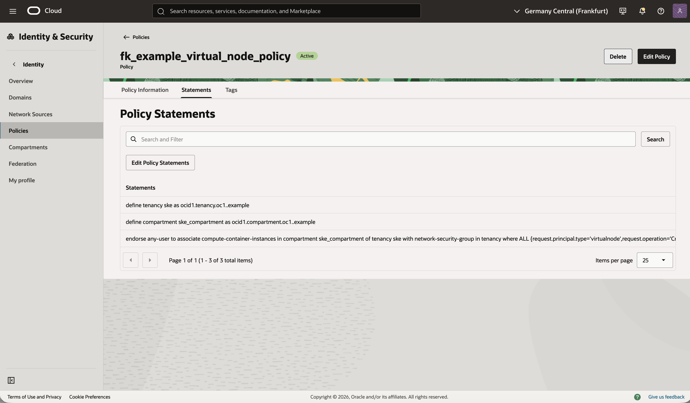

# Example 01: Policy Only

In this first example, we deploy a **minimal Oracle Cloud Infrastructure (OCI) IAM policy** using **Terraform/OpenTofu**.
The example creates a single tenancy-level policy and does not create a dynamic group.
This makes it a good starting point for learning explicit OCI IAM management or testing policy-only authorization patterns.

This example is intentionally simple and focuses only on the **policy resource**,
without dynamic groups, workload deployment, networking, or broader IAM hierarchy design.

---

## 🧭 Overview

This deployment creates:
- One OCI IAM policy named `fk_example_virtual_node_policy`
- A small set of explicit policy statements passed directly to the module
- No dynamic group and no additional OCI infrastructure

The example demonstrates the most minimal way to use the module when you want to manage only the policy resource itself.

---

## 🚀 Deployment Steps

Copy the example variables file and fill in your OCI values:

```bash
cp terraform.tfvars.example terraform.tfvars
```

Initialize and apply the Terraform/OpenTofu configuration:

```bash
tofu init
tofu plan
tofu apply
```

This example uses:
- `oci.targetregion` to discover the tenancy home region
- `oci.homeregion` to create IAM resources in the correct OCI region for identity services

After a successful deployment, you should see the policy created in your OCI tenancy.

---

## 🖼️ OCI Console View

Below you can see the resulting IAM policy as displayed in the OCI Console:



After deployment, you should see:
- A single IAM policy named `fk_example_virtual_node_policy`
- The policy created at the tenancy level
- The explicit policy statements rendered in the OCI Console

This is a minimal OCI IAM policy layout with no dynamic group attached.

---

## 🧹 Cleanup

To remove all resources created by this example:

```bash
tofu destroy
```

---

## ✅ Summary

This example demonstrates:
- How to create a **basic OCI IAM policy** using Terraform/OpenTofu
- How to keep policy statements fully explicit in the calling layer
- How to use the module without creating a dynamic group
- The foundation for more advanced IAM compositions in later examples

---

## 🌐 Learn More

Visit [FoggyKitchen.com](https://foggykitchen.com/) for OCI, multicloud, and Terraform/OpenTofu learning resources.

---

## 🪪 License

Licensed under the **Universal Permissive License (UPL), Version 1.0**.  
See [LICENSE](../../LICENSE) for more details.
