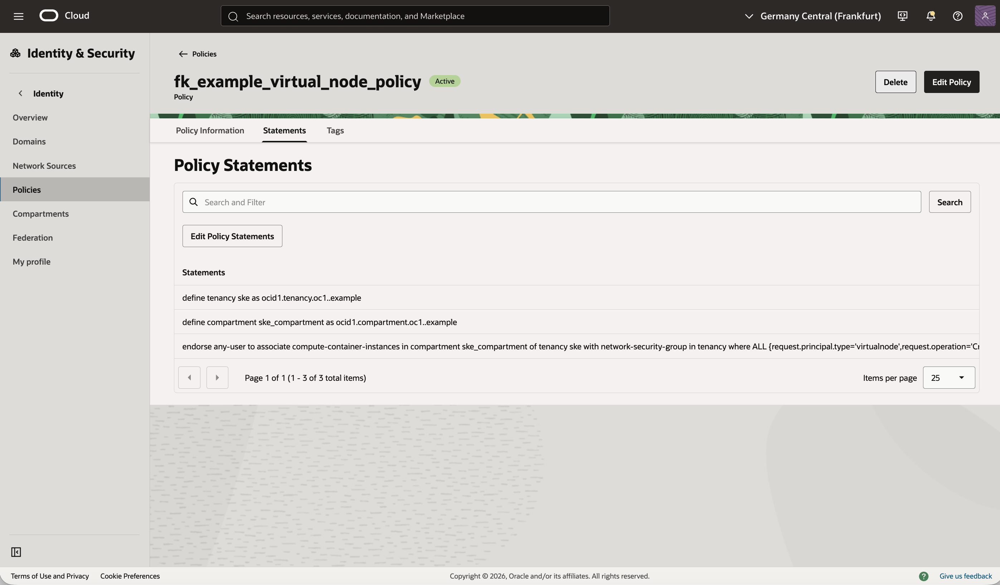
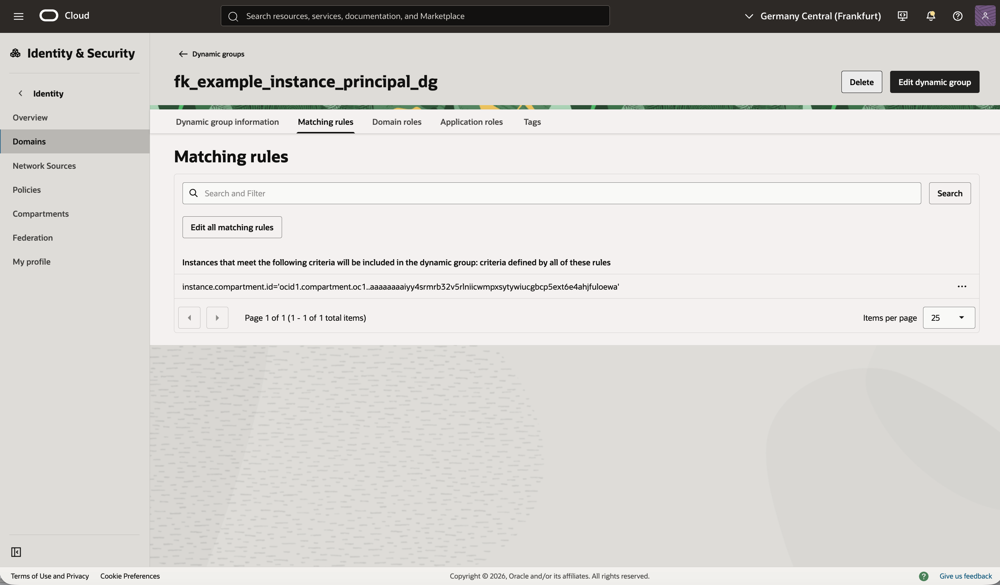

# Example 02: Dynamic Group With Policy

In this second example, we deploy a **common Oracle Cloud Infrastructure (OCI) instance-principal pattern** using **Terraform/OpenTofu**.
The example creates a dynamic group and a tenancy-level IAM policy that grants access to selected OCI services for resources in a target compartment.
This makes it a good starting point for learning how OCI workloads can authenticate through dynamic groups instead of static user credentials.

This example is intentionally focused on the **identity and authorization layer**,
without workload deployment, networking, or a broader application stack.

---

## 🧭 Overview

This deployment creates:
- One OCI Dynamic Group named `fk_example_instance_principal_dg`
- One OCI IAM policy named `fk_example_instance_principal_policy`
- A matching rule based on `instance.compartment.id`
- Explicit policy statements granting access to Autonomous Database backups and Vault reads

The example demonstrates a reusable pattern for workloads such as OKE worker nodes or compute instances that need OCI API access through instance principals.

---

## 🚀 Deployment Steps

Copy the example variables file and fill in your OCI values:

```bash
cp terraform.tfvars.example terraform.tfvars
```

Initialize and apply the Terraform/OpenTofu configuration:

```bash
tofu init
tofu plan
tofu apply
```

This example uses:
- `oci.targetregion` to discover the tenancy home region
- `oci.homeregion` to create IAM resources in the correct OCI region for identity services
- `compartment_ocid` to scope the dynamic group matching rule and policy statements

After a successful deployment, you should see both the dynamic group and the policy created in your OCI tenancy.

---

## 🖼️ OCI Console View

Below you can see the resulting dynamic group and IAM policy as displayed in the OCI Console:





After deployment, you should see:
- A dynamic group named `fk_example_instance_principal_dg`
- A tenancy-level IAM policy named `fk_example_instance_principal_policy`
- A matching rule scoped to the target compartment
- Explicit policy statements granting OCI service access to that dynamic group

This is a minimal OCI instance-principal authorization layout built from one dynamic group and one policy.

---

## 🧹 Cleanup

To remove all resources created by this example:

```bash
tofu destroy
```

---

## ✅ Summary

This example demonstrates:
- How to create an **OCI dynamic group** using Terraform/OpenTofu
- How to attach a **tenancy-level IAM policy** to that principal model
- How to express instance-principal style authorization with explicit policy statements
- The foundation for more advanced OCI workload access patterns

---

## 🌐 Learn More

Visit [FoggyKitchen.com](https://foggykitchen.com/) for OCI, multicloud, and Terraform/OpenTofu learning resources.

---

## 🪪 License

Licensed under the **Universal Permissive License (UPL), Version 1.0**.  
See [LICENSE](../../LICENSE) for more details.
